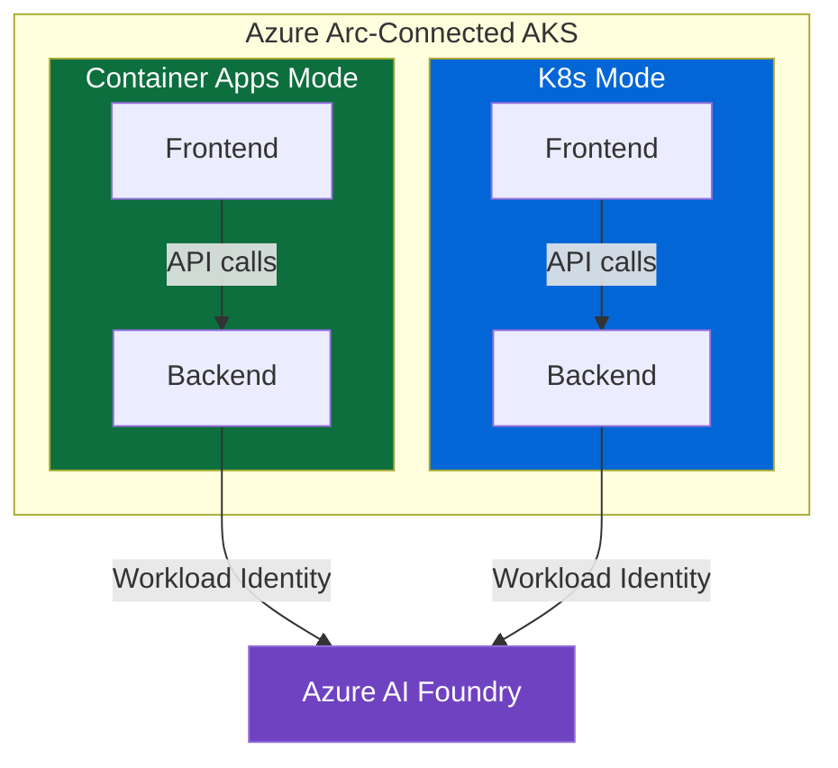
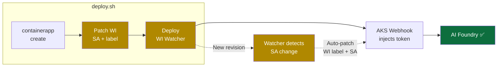
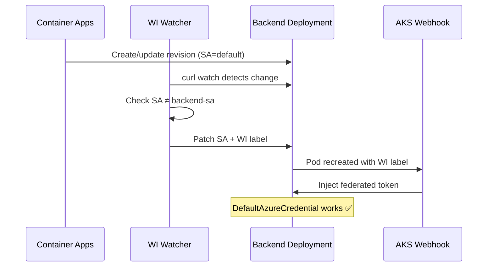
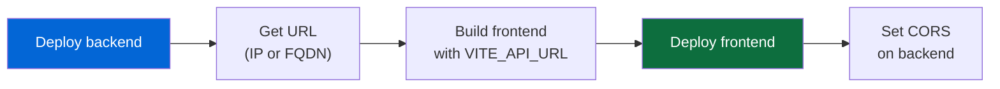
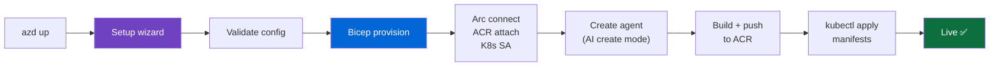
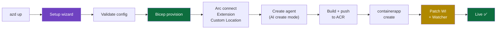

# Deployment

## Overview

Edge Core Chat is a **static frontend** that connects to any backend implementing the [API contract](/1-getting-started/architecture.md#api-contract).

For the reference server (Express + Azure AI Foundry), two deployment modes are available via `azd` (Azure Developer CLI), both running on Arc-connected AKS clusters.



## Azure Deployment (azd)

### Recipes

Recipes are pre-configured deployment profiles that set all required env vars for you. Set `RECIPE` before running `azd up`:

| Recipe | Deploy mode | VM size           | AI mode                | Extras                        |
| ------ | ----------- | ----------------- | ---------------------- | ----------------------------- |
| `all`  | `k8s`       | `Standard_D2s_v3` | `create` (gpt-4o-mini) | 2 nodes                       |
| `dev`  | `k8s`       | `Standard_B2s`    | `mock`                 | Admin routes enabled, CORS=\* |

When `RECIPE` is set, the recipe populates all required env vars before the wizard runs. The wizard still prompts for subscription and location.

When `RECIPE` is NOT set, `azd up` launches the full interactive wizard (see below).

### Interactive Setup Wizard

Running `azd up` without setting `RECIPE` launches an interactive setup wizard (`hooks/preprovision.sh`) that walks through all configuration with arrow-key selectors. Current values are pre-selected — press Enter to keep them.

**Wizard steps:**

| Step               | What it configures                                                    |
| ------------------ | --------------------------------------------------------------------- |
| ⓪ Subscription     | Selects Azure subscription (auto-detects default)                     |
| ① Infrastructure   | Prefix, region, node count, VM size, deploy mode                      |
| ② Deploy           | Deploy scope (all/frontend/backend), cleanup prompts on scope change  |
| ③ AI Configuration | AI mode: **create** (auto-provision), **byo** (existing), or **mock** |
| ④ Backend Settings | Streaming, CORS, admin routes                                         |

**Key behaviors:**

- **Infrastructure locking**: After first provision (`PROVISION_DONE=true`), infra settings are locked. The wizard shows current values but disables selectors. Run `azd down` first to unlock.
- **AI create mode**: Provisions an AI Foundry hub, project, and model deployment. The wizard queries available models/quota in your region. After Bicep provision, `server/scripts/create-agent.js` creates the agent via Node.js SDK.
- **Quota validation**: In create mode, the wizard checks TPM quota for the selected model before proceeding. If insufficient, it offers to adjust capacity or pick a different model.
- **Cleanup on config change**: When narrowing deploy scope or switching AI mode from `create` to another mode, the wizard prompts whether to clean up the now-unused resources.
- **Existing infra detection**: `infra/defaults.sh` auto-detects AKS, ACR, identity from Azure, reads config from RG tags, and derives AI mode from hub existence. See [Resume / New Machine](#resume--new-machine).
- **Re-run behavior**: After first provision, shows a **Deploy/Modify** choice instead of the full wizard. Deploy goes straight to summary; Modify opens the wizard with locked infrastructure. See [Re-run Behavior](#re-run-behavior).
- **CI/automation**: Pass `-y` or `AUTO_YES=true` to skip all prompts and use saved values + defaults.
- **Auto-deploy**: After confirming the config summary, the wizard asks whether to skip the deploy confirmation too. If yes, provision runs and deploy starts automatically — no second prompt.

> **Manual setup is still supported.** You can set all env vars with `azd env set` before running `azd up`. The wizard will pre-select your values. The [Environment Variables](#environment-variables) section below lists all options.

### Prerequisites

| Tool                                                                                                     | macOS                    | Windows                             | Linux                                                     |
| -------------------------------------------------------------------------------------------------------- | ------------------------ | ----------------------------------- | --------------------------------------------------------- |
| [Azure CLI](https://learn.microsoft.com/en-us/cli/azure/install-azure-cli)                               | `brew install azure-cli` | `winget install Microsoft.AzureCLI` | `curl -sL https://aka.ms/InstallAzureCLIDeb \| sudo bash` |
| [Azure Developer CLI](https://learn.microsoft.com/en-us/azure/developer/azure-developer-cli/install-azd) | `brew install azd`       | `winget install Microsoft.Azd`      | `curl -fsSL https://aka.ms/install-azd.sh \| bash`        |
| [Git](https://git-scm.com) (bash included on Windows)                                                    | pre-installed            | `winget install Git.Git`            | pre-installed                                             |
| `kubectl`                                                                                                | `brew install kubectl`   | `winget install Kubernetes.kubectl` | `az aks install-cli`                                      |

**Additional tools** (needed by some deploy scripts, validated automatically):

- `envsubst` - macOS: `brew install gettext` · Linux: `apt-get install gettext-base` · Windows: included in Git Bash
- `openssl` - macOS: `brew install openssl` · Linux: `apt-get install openssl` · Windows: included in Git Bash

**Azure CLI extensions** (`connectedk8s`, `k8s-extension`, `customlocation`, `containerapp`) are **auto-installed** by the scripts if missing.

> **You don't need to memorize any of this.** Every script validates its own prerequisites before running. If something is missing, you'll see exactly what to install with a copy-paste command for your OS:
>
> ```
>   ━━━ Prerequisites check failed ━━━
>   ❌ Missing CLI tool: kubectl
>      Install: brew install kubectl
>   ❌ Not logged into Azure CLI - run: az login
> ```

#### Cross-platform support

`azure.yaml` uses the `windows:`/`posix:` hook format so `azd up` works from any terminal:

| Platform                       | How it works                                                                  |
| ------------------------------ | ----------------------------------------------------------------------------- |
| **macOS / Linux**              | `azd` runs `.sh` hooks directly                                               |
| **Windows (PowerShell / cmd)** | `azd` runs `.ps1` wrappers → auto-finds Git Bash → delegates to `.sh` scripts |
| **Windows (Git Bash)**         | `azd` runs `.sh` hooks directly (same as Mac/Linux)                           |
| **WSL**                        | Same as Linux                                                                 |

Git Bash inherits the full Windows PATH - all tools installed via winget/MSI (az, kubectl, etc.) are visible from bash. No duplicate installs needed.

#### Testing hooks

```bash
# Via azd (recommended - loads env automatically)
azd hooks run preprovision
azd hooks run postprovision
azd hooks run postup

# Test the Windows (PowerShell) path from any OS
azd hooks run preprovision --platform windows

# Or run directly (load env first)
eval "$(azd env get-values)"
./hooks/deploy.sh
```

#### Windows: CRLF line endings

Shell scripts must use LF. The `.gitattributes` enforces this, but if you cloned before it was added, fix with:

```bash
git rm --cached -r . && git reset --hard
```

#### What gets validated per script

| Script                          | CLI tools                              | Az extensions                                                     | Env vars                                             | Cluster context   |
| ------------------------------- | -------------------------------------- | ----------------------------------------------------------------- | ---------------------------------------------------- | ----------------- |
| `hooks/preprovision.sh`         | `az`, `azd`                            | -                                                                 | `ARC_PREFIX`, `NODE_COUNT`, `VM_SIZE`, `DEPLOY_MODE` | -                 |
| `hooks/postprovision.sh`        | `az`, `azd`                            | -                                                                 | - (delegates)                                        | -                 |
| `hooks/deploy.sh`               | `az`, `azd`                            | -                                                                 | - (auto-loads)                                       | -                 |
| `k8s/postprovision.sh`          | `az`, `kubectl`                        | `connectedk8s`                                                    | `AZURE_LOCATION`, `AZURE_WI_CLIENT_ID`               | - (fetches creds) |
| `k8s/deploy.sh`                 | `az`, `kubectl`, `envsubst`, `openssl` | -                                                                 | `ARC_PREFIX`                                         | ✅ auto-fetches   |
| `containerapp/postprovision.sh` | `az`, `kubectl`                        | `connectedk8s`, `k8s-extension`, `customlocation`, `containerapp` | `AZURE_LOCATION`, `AZURE_WI_CLIENT_ID`               | - (fetches creds) |
| `containerapp/deploy.sh`        | `az`, `kubectl`, `envsubst`            | `containerapp`                                                    | `ARC_PREFIX`                                         | ✅ auto-fetches   |

All mode scripts also verify `az login` status. Az extensions are auto-installed if missing.

### Quick Start

**Recipe mode (recommended)** — a recipe sets all defaults for you:

```bash
azd init
azd env set RECIPE all    # full stack + AI Foundry (gpt-4o-mini, D2s_v3, 2 nodes)
azd up                    # prompts for subscription + location, recipe handles the rest
```

**Dev/test recipe** — cheapest option with mock AI:

```bash
azd init
azd env set RECIPE dev    # B2s VM, mock AI, admin routes, CORS=*
azd up
```

**Custom wizard** — run `azd up` without `RECIPE` to walk through the interactive wizard:

```bash
azd init
azd up    # interactive wizard walks you through all config
```

**CI/Automation** — recipe + `-y` flag for non-interactive pipelines:

```bash
azd env new my-chat
azd env set RECIPE all
azd up -- -y
```

**Manual setup (advanced)** — pre-set env vars, wizard pre-selects your values:

```bash
azd init

azd env set NODE_COUNT "2"
azd env set VM_SIZE "Standard_D2s_v3"
azd env set DEPLOY_MODE "k8s"

azd up
```

**Common commands:**

```bash
azd up                  # full wizard — modify settings + provision + deploy
./hooks/deploy.sh       # fast redeploy — current settings, no provision
./hooks/deploy.sh -y    # instant redeploy, skip confirmation
AUTO_YES=true azd up    # skip all prompts (CI/automation)
azd down --force --purge  # tear down everything
```

### Two Deployment Modes

Switch with `azd env set DEPLOY_MODE`:

|                     | `k8s`                                      | `containerapp`                                       |
| ------------------- | ------------------------------------------ | ---------------------------------------------------- |
| **Ingress**         | AKS App Routing (managed nginx)            | Envoy (Container Apps extension)                     |
| **TLS**             | Self-signed (custom domain for real cert)  | Free `*.k4apps.io` + auto TLS                        |
| **API URL**         | Auto-detected from ingress IP              | Auto-detected from backend FQDN                      |
| **Regions**         | Any AKS region                             | [11 regions only](#container-apps-supported-regions) |
| **Min VM**          | D2s_v3 (2 vCPU / 8 GB)                     | D4s_v3 (4 vCPU / 16 GB)                              |
| **Total pods**      | ~32                                        | ~62 (~30 from extension)                             |
| **Autoscaling**     | Manual replica count                       | KEDA built-in (1-3 replicas)                         |
| **Offline capable** | Yes (kubectl apply with pre-pulled images) | No (extension phones home)                           |
| **Extra config**    | -                                          | `CUSTOM_LOCATION_OID` required                       |

### When to Use Which

**Choose `k8s` when:**

- Deploying in any Azure region (no restrictions)
- Cost-sensitive - runs on smaller VMs (D2s_v3)
- Need offline/disconnected capability for edge scenarios
- You have a custom domain for TLS, or self-signed is acceptable
- Want fewer system pods and simpler debugging (`kubectl` native)

**Choose `containerapp` when:**

- Need free HTTPS with a Microsoft-provided domain (`*.k4apps.io`)
- Want built-in autoscaling (KEDA) without manual configuration
- Deploying in a [supported region](#container-apps-supported-regions)
- Extension overhead (~30 extra pods, ~8 CPU) is acceptable
- Want Azure Portal management of container apps

### Environment Variables

> Most of these are set automatically by the [interactive wizard](#interactive-setup-wizard). Manual `azd env set` is optional.

**Infrastructure (Bicep params via `main.parameters.json`):**

| Variable              | Required          | Description                                                                                                                                                |
| --------------------- | ----------------- | ---------------------------------------------------------------------------------------------------------------------------------------------------------- |
| `RECIPE`              | optional          | Deployment recipe: `all` (full stack + AI Foundry), `dev` (mock + cheapest VM), or empty for interactive wizard                                            |
| `ARC_PREFIX`          | auto              | Auto-derived from azd environment name — do NOT set manually                                                                                               |
| `NODE_COUNT`          | ✅                | AKS node count (e.g. `2`)                                                                                                                                  |
| `VM_SIZE`             | ✅                | AKS VM size (e.g. `Standard_D4s_v3` or `Standard_D2s_v3`)                                                                                                  |
| `DEPLOY_MODE`         | ✅                | `k8s` or `containerapp`                                                                                                                                    |
| `DEPLOY_SCOPE`        | optional          | `all` (default), `frontend`, or `backend`                                                                                                                  |
| `AZURE_LOCATION`      | auto              | Set during `azd init` (region dropdown)                                                                                                                    |
| `CUSTOM_LOCATION_OID` | containerapp only | Custom Locations RP Object ID ([how to get](#getting-custom-location-oid))                                                                                 |
| `AI_RESOURCE_GROUP`   | optional          | RG containing AI Foundry — enables cross-RG RBAC via postprovision hook (not injected into pods). Safe for `azd down` — only your deployment RG is tracked |
| `AZURE_WI_CLIENT_ID`  | auto              | Managed Identity client ID — set by Bicep output                                                                                                           |

**AI configuration (wizard step ③):**

| Variable              | Default       | Description                                                                                                   |
| --------------------- | ------------- | ------------------------------------------------------------------------------------------------------------- |
| `AI_MODE`             | `byo`         | `create` (auto-provision AI Foundry), `byo` (existing project), or `mock` (dummy responses). Auto-derived from hub existence on resume |
| `AI_MODEL_NAME`       | `gpt-4o-mini` | Model to deploy (create mode only)                                                                            |
| `AI_MODEL_VERSION`    | `2024-07-18`  | Model version (create mode only)                                                                              |
| `AI_MODEL_CAPACITY`   | `1`           | Model capacity in K TPM (create mode only) — validated against quota                                          |
| `AI_PROJECT_ENDPOINT` | -             | Azure AI Foundry endpoint (required for `byo` mode, auto-set in `create` mode)                                |
| `AI_AGENT_ID`         | -             | AI Foundry agent ID (required for `byo` mode, auto-created in `create` mode, persisted as RG tag)              |

**Wizard state (set automatically, do not edit manually):**

| Variable            | Description                                                                                  |
| ------------------- | -------------------------------------------------------------------------------------------- |
| `WIZARD_DONE`       | Set to `true` after the wizard completes — indicates config has been validated interactively |
| `PROVISION_DONE`    | Set to `true` after first successful provision — locks infrastructure settings               |
| `PREV_DEPLOY_SCOPE` | Tracks previous deploy scope — used to detect scope narrowing and offer cleanup              |
| `PREV_AI_MODE`      | Tracks previous AI mode — used to detect mode changes and offer resource cleanup             |
| `CLEANUP_AI`        | `keep` or `delete` — what to do with AI resources when switching away from create mode       |
| `CLEANUP_FRONTEND`  | `yes` or `no` — remove frontend pods when narrowing scope                                    |
| `CLEANUP_BACKEND`   | `yes` or `no` — remove backend pods when narrowing scope                                     |
| `AUTO_YES`          | One-shot flag — set via temp file when user opts for auto-deploy, consumed by deploy.sh       |

**Resource settings (pod scheduling, not used by Bicep):**

Requests are what Kubernetes **reserves** on the node (affects scheduling). Limits are the **burst ceiling** (max the pod can use). Defaults are right-sized for a typical idle-to-moderate workload on D2s_v3 nodes - override if you expect heavy traffic.

| Variable                  | Default  | Description                                  |
| ------------------------- | -------- | -------------------------------------------- |
| `BACKEND_REPLICAS`        | `1`      | Backend replica count                        |
| `FRONTEND_REPLICAS`       | `1`      | Frontend replica count                       |
| `BACKEND_CPU`             | `250m`   | Backend CPU limit (burst ceiling)            |
| `BACKEND_CPU_REQUEST`     | `50m`    | Backend CPU request (scheduling reservation) |
| `BACKEND_MEMORY`          | `512Mi`  | Backend memory limit                         |
| `BACKEND_MEMORY_REQUEST`  | `256Mi`  | Backend memory request                       |
| `FRONTEND_CPU`            | `100m`   | Frontend CPU limit                           |
| `FRONTEND_CPU_REQUEST`    | `10m`    | Frontend CPU request                         |
| `FRONTEND_MEMORY`         | `128Mi`  | Frontend memory limit                        |
| `FRONTEND_MEMORY_REQUEST` | `64Mi`   | Frontend memory request                      |
| `IMAGE_TAG`               | `latest` | Container image tag                          |

> **Why split request/limit?** On 2-node D2s_v3 clusters, system pods + Arc agents consume ~90% of allocatable CPU. Setting request = limit (e.g. 250m/250m) causes `FailedScheduling: Insufficient cpu` even though actual usage is ~2m idle. The split lets pods schedule easily (60m total reserved) while still being able to burst under load.

**App settings (injected into pods at deploy time, not used by Bicep):**

| Variable              | Default     | Description                                                                                                           |
| --------------------- | ----------- | --------------------------------------------------------------------------------------------------------------------- |
| `VITE_API_URL`        | auto-detect | Backend API URL - required for `DEPLOY_SCOPE=frontend`, auto-detected otherwise                                       |
| `DATASOURCES`         | `mock`      | `mock` (no AI needed) or `api` (Azure AI Foundry) — auto-set by wizard based on `AI_MODE`                             |
| `STREAMING`           | `enabled`   | `enabled` or `disabled` - SSE streaming for responses                                                                 |
| `ENABLE_ADMIN_ROUTES` | `false`     | Enable `/api/admin/*` endpoints for runtime toggles                                                                   |
| `CORS_ORIGINS`        | `auto`      | Allowed origins — `auto` detects from frontend ingress URL at deploy time. Set `*` for all origins, or a specific URL |
| `AI_PROJECT_ENDPOINT` | -           | Azure AI Foundry endpoint — see [AI configuration](#environment-variables) table above                                |
| `AI_AGENT_ID`         | -           | AI Foundry agent ID — see [AI configuration](#environment-variables) table above                                      |

### Deploy Scope (BYOB)

Control what gets deployed with `DEPLOY_SCOPE`:

| Scope           | What deploys       | Use case                      |
| --------------- | ------------------ | ----------------------------- |
| `all` (default) | Frontend + backend | Full deployment               |
| `frontend`      | Frontend only      | Bring your own backend (BYOB) |
| `backend`       | Backend only       | Headless API deployment       |

**Frontend-only example (BYOB):**

```bash
azd env set DEPLOY_SCOPE "frontend"
azd env set VITE_API_URL "https://your-backend.com/api"
azd up
```

The deploy output will show your frontend URL and remind you to add it to your backend's CORS config:

```
✅ Frontend: https://<your-frontend-url>
⚠ Add this origin to your backend's CORS config:
  CORS_ORIGINS=https://<your-frontend-url>
```

### Identity (Workload Identity)

Both modes use **Azure Workload Identity** - no secrets, no env vars with credentials.


- **Per-pod scoping**: only the backend gets an Azure identity
- **Frontend**: no identity needed (serves static files)
- **RBAC**: `Cognitive Services User` + `OpenAI Contributor` + `Azure AI Developer` roles, scoped to the AI Foundry resource group
- **Cross-RG support**: AI Foundry can live in a different resource group - set `AI_RESOURCE_GROUP` and the postprovision hook assigns RBAC roles via `az role assignment create`. This is done outside Bicep intentionally so `azd down` only deletes your deployment's resource group, not the shared AI Foundry RG
- **No code changes**: `DefaultAzureCredential` in the server handles everything automatically

**How identity works per mode:**

|                   | K8s                                               | Container Apps on Arc                                                                              |
| ----------------- | ------------------------------------------------- | -------------------------------------------------------------------------------------------------- |
| **Mechanism**     | WI webhook injects token natively                 | Deploy script patches WI into the pod ([details](#container-apps-workload-identity-workaround))    |
| **Setup**         | SA label + federated credential                   | Same SA + federated credential, patched onto containerapp deployment                               |
| **Watcher image** | N/A                                               | `mcr.microsoft.com/azurelinux/base/core:3.0` - uses `curl` to K8s API directly (no kubectl needed) |
| **Handled by**    | `postprovision.sh` (SA) + `deploy.sh` (pod label) | `postprovision.sh` (SA) + `deploy.sh` (patch + watcher)                                            |
| **User action**   | None - fully automatic                            | None - fully automatic                                                                             |

**Connecting to AI Foundry (API mode):**

```bash
# Set your AI Foundry details
azd env set AI_PROJECT_ENDPOINT "https://<name>.cognitiveservices.azure.com/api/projects/<project>"
azd env set AI_AGENT_ID "<agent-name>:<version>"
azd env set DATASOURCES "api"

# If AI Foundry is in a different resource group than the AKS cluster:
azd env set AI_RESOURCE_GROUP "<rg-containing-ai-foundry>"

# Find the resource group if needed:
az cognitiveservices account list --query "[].{name:name, resourceGroup:resourceGroup}" -o table

# Deploy
azd up
```

#### Connecting an existing cluster to AI Foundry

Already deployed with mock mode and want to switch to AI Foundry? Use the standalone hook - no re-provisioning needed:

```bash
# Set the AI Foundry vars
azd env set AI_PROJECT_ENDPOINT "https://<name>.cognitiveservices.azure.com/api/projects/<project>"
azd env set AI_AGENT_ID "<agent-name>:<version>"
azd env set AI_RESOURCE_GROUP "<rg-containing-ai-foundry>"

# Connect (assigns RBAC + redeploys with DATASOURCES=api)
./hooks/connect-foundry.sh

# Or skip confirmation
./hooks/connect-foundry.sh -y
```

This assigns the required RBAC roles (Cognitive Services User, OpenAI Contributor, Azure AI Developer) on the AI Foundry resource group, sets `DATASOURCES=api`, and redeploys the backend. No cluster re-provisioning required.

### Container Apps Workload Identity Workaround

Container Apps on Arc (connected environments) **do not support managed identity natively**. To enable Workload Identity for AI Foundry access, the deploy script applies a workaround:

1. **On deploy**: the script patches the K8s deployment created by Container Apps to use our Workload Identity service account and pod label
2. **WI watcher**: a lightweight pod (`wi-watcher`) that:
   - **On startup**: immediately scans all existing deployments and patches any SA mismatches (handles deploy-before-watcher race)
   - **On watch**: monitors for deployment changes via the K8s watch API (event-driven, not polling). When Container Apps creates a new revision (e.g. from Portal or `az containerapp update`), the watcher automatically re-applies the WI patch
3. **AKS webhook**: sees the WI label on the pod → injects `AZURE_CLIENT_ID`, `AZURE_TENANT_ID`, and `AZURE_FEDERATED_TOKEN_FILE`
4. **DefaultAzureCredential**: picks up the federated token → authenticates to AI Foundry

**Architecture:**



**What the watcher does:**



**WI watcher image**: The watcher pod uses `mcr.microsoft.com/azurelinux/base/core:3.0` (MCR - no rate limits) and talks to the K8s API directly via `curl` with the mounted service account token. No kubectl binary needed, no Docker Hub imports, no ACR pull secrets.

> **Note**: `envsubst` is scoped to template variables only (`${PREFIX}`, `${NAMESPACE}`, etc.) to avoid replacing runtime shell variables inside the watcher's embedded script.

If the watcher fails, check:

```bash
# Verify the watcher pod can reach the K8s API
kubectl exec <watcher-pod> -n <namespace> -- sh -c 'curl -sf --cacert /var/run/secrets/kubernetes.io/serviceaccount/ca.crt -H "Authorization: Bearer $(cat /var/run/secrets/kubernetes.io/serviceaccount/token)" https://kubernetes.default.svc/apis/apps/v1/namespaces/<namespace>/deployments | head -5'
```

**Resource overhead**: ~10m CPU, ~32Mi RAM (idle). The watcher uses the K8s watch API - a single persistent connection, zero CPU when no changes happen. This is the same pattern used by cert-manager, external-dns, and other K8s controllers.

> **Note**: This workaround can be removed when Microsoft adds managed identity support to Container Apps on connected environments.

### Frontend to Backend Connection

Both modes deploy the backend first, then build the frontend with the backend URL baked in:



- **K8s mode**: gets ingress IP after backend deploy
- **Container Apps mode**: gets FQDN after backend app creation
- **Custom backend**: `azd env set VITE_API_URL "https://your-backend.com"` to point to any backend
- **CORS**: auto-configured from the frontend URL. Set `CORS_ORIGINS=*` to allow all origins

### Shared Defaults (`infra/defaults.sh`)

All hooks source `infra/defaults.sh`, the **single source of truth** for environment variable defaults. The `apply_defaults()` function:

1. **Derives `ARC_PREFIX`** from the azd environment name (never set manually)
2. **Reads RG tags** — deployment config (scope, streaming, CORS, admin, agent-id, recipe) is persisted as tags on the resource group for cross-machine resume. Tags are **fallback only** — local `azd env set` values always take priority
3. **Auto-detects from Azure** — queries AKS (VM size, node count, location), ACR, managed identity, and AI hub existence
4. **Derives AI_MODE** — if `${PREFIX}-ai-hub` exists → `create`, if `AI_PROJECT_ENDPOINT` is set → `byo`, otherwise → `mock`
5. **Sets sensible defaults** for any remaining unset vars (deploy mode, resource sizing, etc.)

This enables the **resume-from-any-machine** flow — a fresh clone with just the env name and subscription auto-recovers the full configuration.

### Resume / New Machine

After first provision, you can resume from any machine — no need to re-run the wizard or re-set env vars:

```bash
git clone <repo-url> && cd Edge-Core-Chat
azd env new <prefix>                              # env name = your existing prefix
azd env set AZURE_SUBSCRIPTION_ID <sub-id>
azd up
```

`infra/defaults.sh` auto-detects everything from Azure (AKS, ACR, identity, AI hub) and reads deployment config from RG tags. `AI_MODE` is derived from hub existence — no tag needed. The wizard sees `PROVISION_DONE=true` and shows the Deploy/Modify choice instead of the full setup flow.

### Re-run Behavior

After the first provision, `azd up` no longer shows the full wizard. Instead:

| Choice | What happens |
|--------|-------------|
| **Deploy** | Skips wizard, goes straight to config summary → provision (no-op) → deploy |
| **Modify** | Opens wizard with infrastructure settings locked (prefix, region, VM, nodes). Only app-level settings (AI mode, scope, streaming, etc.) can be changed |

To unlock infrastructure settings, run `azd down` first (tears down the resource group).

### What `azd up` Does

**K8s mode:**



**Container Apps mode:**



### Connected vs Disconnected

| Concern        | Connected                    | Disconnected                            |
| -------------- | ---------------------------- | --------------------------------------- |
| Deploy method  | `azd up`                     | `kubectl apply` with pre-pulled images  |
| Identity       | Workload Identity (Azure AD) | Not needed (local model, no Azure auth) |
| Image source   | ACR (cloud)                  | Pre-pulled to nodes or local registry   |
| Backend target | Azure AI Foundry             | Local model endpoint                    |
| Management     | Azure Portal + kubectl       | kubectl only                            |
| Arc            | Full Azure management        | Cluster runs autonomously up to 30 days |

For disconnected: same K8s manifests from `infra/modes/k8s/`, just pre-pull images and skip identity.

### Container Apps Supported Regions

`eastus`, `northcentralus`, `centralus`, `eastasia`, `swedencentral`, `australiaeast`, `westeurope`, `uksouth`, `southeastasia`, `westus`

The preprovision hook validates this automatically - if you select an unsupported region with `containerapp` mode, it fails with the list of valid regions.

### Getting Custom Location OID

Required for `containerapp` mode only. The Custom Locations RP Object ID is tenant-specific.

**Option 1 (CLI):**

```bash
az login --scope https://graph.microsoft.com//.default
az ad sp show --id bc313c14-388c-4e7d-a58e-70017303ee3b --query id -o tsv
```

**Option 2 (Portal):**

1. Azure Portal → Azure AD → Enterprise applications
2. Set filter to "All Applications"
3. Search: `bc313c14-388c-4e7d-a58e-70017303ee3b`
4. Copy the **Object ID** (not Application ID)

Then set it:

```bash
azd env set CUSTOM_LOCATION_OID "<object-id>"
```

### Custom Locations: Known Issues

> **TL;DR**: `az connectedk8s enable-features --features custom-locations` is unreliable - it hangs, silently fails, or times out. The postprovision script works around this with a 60-second timeout and kill, but you may need to retry or enable manually.

**The problem**: Enabling the `custom-locations` feature on an Arc-connected cluster (`az connectedk8s enable-features`) is a notoriously flaky operation:

| Issue                           | What happens                                                                           | Workaround in script                                                      |
| ------------------------------- | -------------------------------------------------------------------------------------- | ------------------------------------------------------------------------- |
| **Hangs indefinitely**          | Command never returns, blocks the entire deployment                                    | Run in background with `&`, kill after 60s timeout                        |
| **Silently succeeds**           | Feature is already enabled but the command still takes minutes to "verify"             | Timeout + `log_warn` - continues anyway since it's likely already enabled |
| **Fails on re-run**             | Returns error if features are already enabled                                          | `&>/dev/null` suppresses the error, script continues                      |
| **OID-dependent**               | Without `CUSTOM_LOCATION_OID`, the command may succeed but custom locations won't work | preprovision validates OID; auto-detects from Azure AD if possible        |
| **Race with extension install** | The extension install (step 3) can fail if enable-features hasn't propagated yet       | Extension install has its own 10-minute wait loop                         |

**What the script does** (in `containerapp/postprovision.sh`):

```bash
# Run enable-features in background (it may hang)
az connectedk8s enable-features ... &>/dev/null &
ENABLE_PID=$!
sleep 60

# If still running after 60s, kill it and move on
if kill -0 "$ENABLE_PID" 2>/dev/null; then
    kill "$ENABLE_PID" 2>/dev/null || true
    log_warn "enable-features timed out - may already be enabled"
fi
```

**If custom locations fail**, check manually:

```bash
# Verify features are enabled
az connectedk8s show --name <cluster> --resource-group <rg> \
    --query "features" -o table

# If not, retry manually (may take several minutes)
az connectedk8s enable-features \
    --name <cluster> --resource-group <rg> \
    --custom-locations-oid <oid> \
    --features cluster-connect custom-locations

# Verify the custom location exists
az customlocation list --resource-group <rg> -o table
```

> **Note**: This is a known Azure limitation, not a bug in our scripts. The `k8s` mode avoids all of this - it doesn't use custom locations.

## Frontend Deployment (standalone)

The frontend can also be deployed independently to any static hosting provider.

### Build

```bash
npm run build         # Standard build
npm run build:static  # Relative paths
```

### Configure Backend URL

```sh
# .env.production
VITE_API_URL=https://your-backend-api.com
```

### Deploy Options

**Azure Blob Storage:**

```bash
npm run build
az storage blob upload-batch --account-name <storage-account> --source dist -d '$web'
```

**Any static host:**
Upload `dist/` folder contents

## Backend Deployment (standalone)

You can implement your own backend - the frontend connects to any server implementing the API contract.

### API Contract

```
POST /api/responses
  Request:  { input, conversationId?, stream? }
  Response: { conversationId, isNew, response: { output: [...] } }
```

See [architecture.md#api-contract](/1-getting-started/architecture.md#api-contract) for full spec.

### CORS Requirements

Your backend must allow requests from your frontend's origin:

```
Access-Control-Allow-Origin: https://your-frontend-url.com
```

### Reference Server

We provide a reference Express server with Azure AI Foundry integration. This is **optional** - you can implement your own backend.

## Local Development

```bash
npm run dev          # Frontend only (mock mode)
```

For reference server, see the server README.

## Cookbooks

See [Cookbooks](/3-development/cookbooks) for copy-paste recipes: full stack, frontend-only, backend-only, mock mode, environment management, and more.

---

_Last updated: 2026-03-05 | Last commit: cb3b21b_
