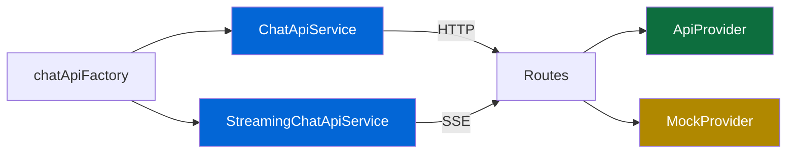

# API Services

The services layer handles all communication between the frontend and your backend server.

## Overview

<LiteTree>
---
- src/services/
    chatApi.ts                    // Standard (non-streaming) REST API
    streamingChatApi.ts           // SSE streaming API
    chatApiFactory.ts             // Dynamic module loader
</LiteTree>

Services implement the **Atomic Pattern** - a single `POST /api/responses` call handles conversation creation, message persistence, and AI response generation.

## ChatApiService (Standard)

The base service for non-streaming chat. Sends a message and waits for the complete response.

```typescript
import { ChatApiService } from "@/services/chatApi";

const api = new ChatApiService();

const result = await api.sendMessage({ message: "Hello!", conversationId: "conv_abc123" });
// result: { message: Message, conversationId: string }
```

### Key Methods

| Method               | Signature                                                                                       | Description                             |
| -------------------- | ----------------------------------------------------------------------------------------------- | --------------------------------------- |
| `sendMessage`        | `(options: SendMessageOptions) => Promise<SendMessageResult>`                                   | Send message, receive complete response |
| `fetchConversations` | `() => Promise<Conversation[]>`                                                                 | List all conversations                  |
| `fetchConversation`  | `(id: string) => Promise<Conversation \| null>`                                                 | Get single conversation                 |
| `fetchMessages`      | `(id: string, options?) => Promise<{ messages: Message[]; hasMore: boolean; lastId?: string }>` | Paginated message fetch                 |
| `createConversation` | `(title?: string) => Promise<Conversation>`                                                     | Create a new conversation               |
| `deleteConversation` | `(id: string) => Promise<void>`                                                                 | Delete a conversation                   |
| `renameConversation` | `(id: string, title: string) => Promise<void>`                                                  | Rename a conversation                   |
| `abort`              | `() => void`                                                                                    | Abort in-flight request                 |

### Pagination

```typescript
const result = await api.fetchMessages("conv_abc123", {
  limit: 20,
  after: "msg_last_id",
});
// result: { messages: Message[], hasMore: boolean, lastId?: string }
```

## StreamingChatApiService (SSE)

Extends `ChatApiService` with Server-Sent Events streaming. The assistant's response arrives incrementally.

```typescript
import { StreamingChatApiService } from "@/services/streamingChatApi";

const api = new StreamingChatApiService();

await api.sendMessageStreaming(
  { message: "Tell me a story", conversationId: "conv_abc123" },
  {
    onStart: ({ conversationId }) => {
      /* stream started */
    },
    onChunk: (content) => {
      /* append delta text */
    },
    onDone: (response) => {
      /* stream complete */
    },
    onError: (error) => {
      /* handle error: error.code, error.message */
    },
  },
);
```

### Stream Callbacks

| Callback  | Signature                                            | Description         |
| --------- | ---------------------------------------------------- | ------------------- |
| `onStart` | `(data: { conversationId: string }) => void`         | Stream established  |
| `onChunk` | `(content: string) => void`                          | Text delta received |
| `onDone`  | `(response: string) => void`                         | Stream completed    |
| `onError` | `(error: { code: string; message: string }) => void` | Stream error        |

### SSE Event Types

The streaming endpoint sends these event types:

```text
data: {"type":"conversation","conversationId":"conv_abc"}
data: {"type":"response.output_text.delta","delta":"Once upon"}
data: {"type":"response.output_text.delta","delta":" a time..."}
data: [DONE]
```

## Chat API Factory

The factory dynamically loads the correct API module based on server settings. This enables code-splitting - the streaming implementation is only downloaded when streaming is enabled.

```typescript
import { loadChatModule } from "@/services/chatApiFactory";

const module = await loadChatModule();
// module.api: BaseChatApi (ChatApi or StreamingChatApi)
// module.useChatConversation: hook for the matching mode
// module.settings: { streaming: boolean }
```

### Server Settings

The factory calls `GET /api/settings` to determine the server mode:

```typescript
const settings = await fetchServerSettings();
// { streaming: boolean }
```

Based on the response, it lazy-loads either:

- `ChatApiService` + `useStandardChatConversation`
- `StreamingChatApiService` + `useStreamingChatConversation`

## Server-Side: DataProvider

The reference server (`server/`) uses a `DataProvider` interface to abstract data sources, mirroring the client-side pluggable pattern:

<LiteTree>
---
- server/providers/
    types.ts                      // DataProvider interface
    index.ts                      // getProvider() factory
    + api/
        ApiProvider.ts            // Microsoft Foundry
    + mock/
        MockProvider.ts           // In-memory store
</LiteTree>

Routes call `getProvider()` which returns the active `DataProvider` based on the `DATASOURCES` env var. Switching between mock and API happens at the provider level - routes are unified and have no knowledge of which backend is active.

### How Client and Server Connect



Both sides communicate through the [API contract](/1-getting-started/architecture.md#api-contract). The client doesn't know which server provider is active, and the server doesn't know which client service is calling - they're decoupled by the contract.

## Implementing a Custom Backend

Your server must implement the [API contract](/1-getting-started/architecture.md#api-contract). The services expect:

| Endpoint                       | Method | Used By                               |
| ------------------------------ | ------ | ------------------------------------- |
| `/api/responses`               | POST   | `sendMessage`, `sendMessageStreaming` |
| `/api/conversations`           | GET    | `fetchConversations`                  |
| `/api/conversations/:id`       | GET    | `fetchConversation`                   |
| `/api/conversations/:id`       | PATCH  | `renameConversation`                  |
| `/api/conversations/:id`       | DELETE | `deleteConversation`                  |
| `/api/conversations/:id/items` | GET    | `fetchMessages`                       |

The base URL is configured via `VITE_API_URL` environment variable (defaults to `/api` for proxy setups).

You can also implement the `DataProvider` interface directly if using the reference server - add your provider alongside `ApiProvider` and `MockProvider`, then update `getProvider()` to return it.

## Error Handling

- **Abort**: Calling `abort()` triggers an `AbortError` which is detected by the `isAbortError()` type guard and cleaned up automatically
- **Network errors**: Surfaced to the UI via the hook's error handling
- **Server errors**: The service reads `ApiErrorResponse` format and throws descriptive errors
